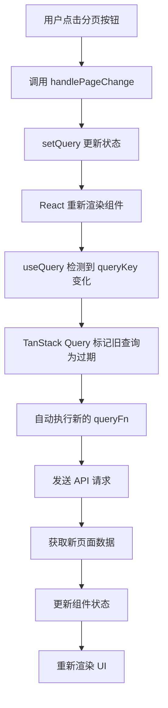

# TanStack Query 响应式数据获取机制

## 📖 概述

本文档详细解释了 TanStack Query 中响应式数据获取的核心机制，以分页功能为例，说明为什么改变页码会自动触发新数据的获取。

## 🎯 核心原理

### 1. 查询键（Query Key）的作用

TanStack Query 使用 **查询键（Query Key）** 作为缓存和重新获取数据的唯一标识符。

```typescript
const {
  data: listData,
  isLoading,
  error,
  refetch
} = useQuery({
  queryKey: ['users', query], // 🔑 核心：包含动态参数的查询键
  queryFn: () => getUserList(query)
});
```

**关键点**：
- `queryKey` 是一个数组，包含了查询的唯一标识
- 当 `queryKey` 中的任何值发生变化时，TanStack Query 会自动重新执行查询
- 在这个例子中，`query` 对象包含了分页参数

### 2. 状态变化触发机制

```typescript
// 初始查询状态
const [query, setQuery] = useState<Query>({
  page: 1,
  limit: 10
});

// 分页变化处理函数
const handlePageChange = (page: number, pageSize: number) => {
  setQuery({ page, limit: pageSize }); // ✨ 状态更新触发重新查询
};
```

## 🔄 完整工作流程

### 流程图



### 详细步骤说明

1. **用户交互**
   ```typescript
   // 用户点击第2页
   <Pagination onChange={handlePageChange} />
   ```

2. **状态更新**
   ```typescript
   const handlePageChange = (page: number, pageSize: number) => {
     // 从 { page: 1, limit: 10 } 变为 { page: 2, limit: 10 }
     setQuery({ page, limit: pageSize });
   };
   ```

3. **查询键变化检测**
   ```typescript
   // 旧的 queryKey
   ['users', { page: 1, limit: 10 }]
   
   // 新的 queryKey
   ['users', { page: 2, limit: 10 }]
   
   // TanStack Query 检测到变化 ✅
   ```

4. **自动重新获取**
   ```typescript
   // 自动调用
   queryFn: () => getUserList({ page: 2, limit: 10 })
   ```

## 💾 缓存机制

### 缓存键值对应关系

TanStack Query 为每个唯一的 queryKey 维护独立的缓存：

```typescript
// 缓存结构示例
{
  "['users', { page: 1, limit: 10 }]": {
    data: { list: [...], pagination: {...} },
    timestamp: "2024-01-01T10:00:00Z",
    status: "success"
  },
  "['users', { page: 2, limit: 10 }]": {
    data: { list: [...], pagination: {...} },
    timestamp: "2024-01-01T10:01:00Z", 
    status: "success"
  },
  "['users', { page: 1, limit: 20 }]": {
    data: { list: [...], pagination: {...} },
    timestamp: "2024-01-01T10:02:00Z",
    status: "success"
  }
}
```

### 缓存优势

1. **快速切换**：已访问的页面可以立即显示，无需重新加载
2. **减少网络请求**：相同参数的查询不会重复发送
3. **离线支持**：缓存的数据在网络断开时仍可使用

## 📊 实际代码示例

### 完整的分页实现

```typescript
import { useState } from 'react';
import { useQuery } from '@tanstack/react-query';
import { Table, Pagination } from 'antd';

const UserList = () => {
  // 📌 查询参数状态
  const [query, setQuery] = useState({
    page: 1,
    limit: 10
  });

  // 📌 响应式查询
  const {
    data: listData,
    isLoading,
    error,
    isFetching // 区分初始加载和后续获取
  } = useQuery({
    queryKey: ['users', query], // 🔑 响应式的查询键
    queryFn: () => getUserList(query),
    staleTime: 5 * 60 * 1000, // 5分钟内认为数据新鲜
    cacheTime: 10 * 60 * 1000, // 10分钟缓存时间
  });

  // 📌 分页处理函数
  const handlePageChange = (page: number, pageSize: number) => {
    setQuery({ page, limit: pageSize }); // ✨ 仅需更新状态
    // 无需手动调用 API，TanStack Query 会自动处理
  };

  return (
    <div>
      <Table
        dataSource={listData?.list || []}
        loading={isLoading || isFetching}
        pagination={false} // 使用自定义分页
        columns={[
          { title: 'ID', dataIndex: 'id' },
          { title: '姓名', dataIndex: 'name' },
          { title: '邮箱', dataIndex: 'email' },
        ]}
      />
      
      <Pagination
        current={query.page}
        pageSize={query.limit}
        total={listData?.pagination?.total || 0}
        onChange={handlePageChange}
        showSizeChanger
        showQuickJumper
        showTotal={(total, range) => 
          `第 ${range[0]}-${range[1]} 条，共 ${total} 条`
        }
      />
    </div>
  );
};
```

## 🔍 QueryKey 深度比较机制

### 比较规则

TanStack Query 使用深度比较来检测 queryKey 的变化：

```typescript
// 这些被认为是不同的查询
['users', { page: 1, limit: 10 }]
['users', { page: 2, limit: 10 }] // ✅ page 不同
['users', { page: 1, limit: 20 }] // ✅ limit 不同
['users', { page: 1, limit: 10, search: 'john' }] // ✅ 增加了 search

// 这些被认为是相同的查询（不会重新获取）
['users', { page: 1, limit: 10 }]
['users', { page: 1, limit: 10 }] // ❌ 完全相同
['users', { limit: 10, page: 1 }] // ❌ 顺序不同但内容相同
```

### 对象引用 vs 值比较

```typescript
// ❌ 错误做法：每次都创建新对象
const queryKey = ['users', { page: query.page, limit: query.limit }];

// ✅ 正确做法：直接使用状态对象
const queryKey = ['users', query];
```

## ⚡ 性能优化技巧

### 1. 使用 keepPreviousData

保持上一页数据，避免加载闪烁：

```typescript
const { data, isLoading, isFetching, isPreviousData } = useQuery({
  queryKey: ['users', query],
  queryFn: () => getUserList(query),
  keepPreviousData: true, // 🚀 保持上一页数据
});

// UI 中显示加载状态
<Table 
  loading={isLoading}
  dataSource={data?.list || []}
  className={isPreviousData ? 'opacity-50' : ''} // 显示过期状态
/>
```

### 2. 预取下一页数据

```typescript
const queryClient = useQueryClient();

const prefetchNextPage = () => {
  if (!isPreviousData && data?.pagination?.hasMore) {
    queryClient.prefetchQuery({
      queryKey: ['users', { ...query, page: query.page + 1 }],
      queryFn: () => getUserList({ ...query, page: query.page + 1 }),
      staleTime: 5 * 60 * 1000,
    });
  }
};

// 在合适的时机调用预取
useEffect(() => {
  prefetchNextPage();
}, [data, query]);
```

### 3. 智能重试策略

```typescript
const { data } = useQuery({
  queryKey: ['users', query],
  queryFn: () => getUserList(query),
  retry: (failureCount, error) => {
    // 404 错误不重试
    if (error.status === 404) return false;
    // 最多重试 3 次
    return failureCount < 3;
  },
  retryDelay: attemptIndex => 
    Math.min(1000 * 2 ** attemptIndex, 30000), // 指数退避
});
```

## 🆚 对比传统方式

### 传统手动方式

```typescript
// ❌ 传统做法：复杂且容易出错
const [users, setUsers] = useState([]);
const [loading, setLoading] = useState(false);
const [error, setError] = useState(null);
const [pagination, setPagination] = useState({ page: 1, limit: 10, total: 0 });

const fetchUsers = async (params) => {
  setLoading(true);
  setError(null);
  try {
    const data = await getUserList(params);
    setUsers(data.list);
    setPagination(prev => ({ ...prev, total: data.pagination.total }));
  } catch (err) {
    setError(err);
  } finally {
    setLoading(false);
  }
};

const handlePageChange = (page, pageSize) => {
  const newPagination = { ...pagination, page, limit: pageSize };
  setPagination(newPagination);
  fetchUsers(newPagination); // 🔴 手动调用
};

// 组件挂载时获取数据
useEffect(() => {
  fetchUsers(pagination);
}, []);
```

### TanStack Query 方式

```typescript
// ✅ TanStack Query：简洁且功能强大
const [query, setQuery] = useState({ page: 1, limit: 10 });

const { data, isLoading, error } = useQuery({
  queryKey: ['users', query],
  queryFn: () => getUserList(query), // 🎯 自动处理所有状态
});

const handlePageChange = (page, pageSize) => {
  setQuery({ page, limit: pageSize }); // ✨ 仅需更新状态
};
```

## 📋 最佳实践总结

### ✅ 推荐做法

1. **结构化查询键**
   ```typescript
   // 好的做法
   const queryKeys = {
     users: ['users'] as const,
     userList: (params: Query) => ['users', 'list', params] as const,
     user: (id: string) => ['users', 'detail', id] as const,
   };
   ```

2. **合理设置缓存时间**
   ```typescript
   useQuery({
     queryKey: ['users', query],
     queryFn: () => getUserList(query),
     staleTime: 5 * 60 * 1000,    // 5分钟内认为数据新鲜
     cacheTime: 10 * 60 * 1000,   // 10分钟后清除缓存
   });
   ```

3. **处理加载状态**
   ```typescript
   const { data, isLoading, isFetching, error } = useQuery({...});
   
   // 区分初始加载和后续获取
   if (isLoading) return <Skeleton />;        // 初始加载
   if (error) return <ErrorComponent />;      // 错误状态
   
   return (
     <Table 
       loading={isFetching}  // 后续获取显示 loading
       dataSource={data?.list || []}
     />
   );
   ```

### ❌ 避免的做法

1. **频繁创建新对象**
   ```typescript
   // 错误：每次渲染都创建新对象
   queryKey: ['users', { page: page, limit: limit }]
   
   // 正确：使用稳定的状态对象
   queryKey: ['users', query]
   ```

2. **忽略错误处理**
   ```typescript
   // 错误：没有错误处理
   const { data } = useQuery({...});
   
   // 正确：完整的状态处理
   const { data, isLoading, error } = useQuery({...});
   ```

## 🎓 总结

TanStack Query 的响应式数据获取机制通过以下核心特性实现了优雅的数据管理：

1. **自动触发**：queryKey 变化自动触发重新获取
2. **智能缓存**：相同参数的查询结果被缓存和复用
3. **状态管理**：自动处理 loading、error、success 状态
4. **性能优化**：内置重试、去重、后台更新等功能

这种声明式的数据获取方式让开发者只需要关注**数据依赖关系**，而不需要手动管理复杂的异步状态，大大提升了开发效率和用户体验。

---

*本文档基于 TanStack Query v4/v5，更多详细信息请参考 [官方文档](https://tanstack.com/query/latest)* 