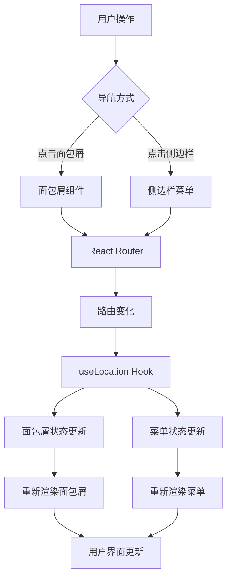
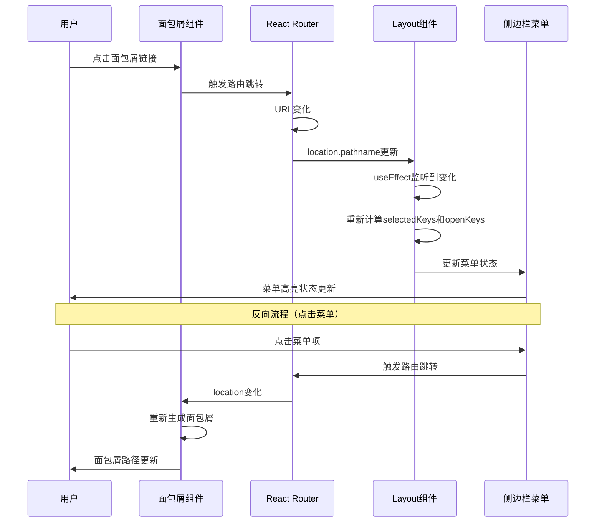

# 面包屑组件与路由联动设计文档

## 📖 概述

本文档详细介绍了React项目中面包屑导航组件的设计思路、实现方案，以及与侧边栏菜单的双向联动机制。通过这套方案，实现了用户导航的一致性和直观性。

## 🎯 设计目标

### 核心需求
1. **自动化导航**：根据当前路由自动生成面包屑路径
2. **视觉优化**：在深色背景下提供良好的可读性
3. **双向联动**：面包屑与侧边栏菜单状态同步
4. **用户体验**：提供直观的导航反馈和交互效果

### 技术要求
- 基于React Router的路由系统
- 支持多级路由导航
- 响应式设计和现代UI交互
- 类型安全的TypeScript实现

## 🏗️ 架构设计

### 整体架构图



### 组件结构

```
src/components/
├── Layout/
│   ├── index.tsx              # 布局组件（包含菜单联动逻辑）
│   └── index.module.scss      # 布局样式
├── Breadcrumb/
│   ├── index.tsx              # 面包屑组件
│   ├── index.module.scss      # 面包屑样式
│   └── index.ts               # 导出文件
```

## 🍞 面包屑组件设计

### 核心设计思路

#### 1. 路由映射策略

采用配置化的路由映射方案，将URL路径映射为用户友好的标题和图标：

```typescript
// 路由配置映射
const routeConfig: Record<string, { title: string; icon?: React.ReactNode }> = {
  '/': { title: '首页', icon: <HomeOutlined /> },
  '/about': { title: '关于我们', icon: <TeamOutlined /> },
  '/contact': { title: '联系我们', icon: <PhoneOutlined /> },
  '/api-example': { title: 'API示例', icon: <ApiOutlined /> },
  '/user-list': { title: '用户列表', icon: <UserOutlined /> },
  '/user': { title: '用户中心', icon: <UserOutlined /> },
  '/user/profile': { title: '个人资料', icon: <ProfileOutlined /> },
  '/user/settings': { title: '设置', icon: <SettingOutlined /> }
};
```

**优势**：
- 集中化管理：所有路由信息统一配置
- 易于维护：新增路由只需添加配置项
- 类型安全：TypeScript提供类型检查
- 图标支持：每个路由可配置对应图标

#### 2. 路径解析算法

```typescript
const Breadcrumb = () => {
  const location = useLocation();
  const pathSnippets = location.pathname.split('/').filter(i => i);
  
  // 动态生成面包屑项
  const breadcrumbItems = [];
  
  // 首页处理逻辑
  if (pathSnippets.length > 0) {
    // 添加首页链接
    breadcrumbItems.push(homeItem);
  } else {
    // 当前就是首页，显示为非链接状态
    breadcrumbItems.push(currentHomeItem);
  }
  
  // 递归构建路径
  pathSnippets.forEach((snippet, index) => {
    const path = `/${pathSnippets.slice(0, index + 1).join('/')}`;
    const routeInfo = routeConfig[path];
    
    if (routeInfo) {
      const isLast = index === pathSnippets.length - 1;
      breadcrumbItems.push(createBreadcrumbItem(path, routeInfo, isLast));
    }
  });
};
```

**核心逻辑**：
1. **路径分割**：将URL按'/'分割为路径片段
2. **递归构建**：从根路径开始逐级构建完整路径
3. **状态区分**：区分中间路径（可点击）和当前页面（不可点击）
4. **配置查找**：根据路径查找对应的标题和图标

#### 3. 智能首页处理

```typescript
// 首页智能显示逻辑
if (pathSnippets.length > 0) {
  // 不在首页 - 显示可点击的首页链接
  breadcrumbItems.push({
    key: 'home',
    title: (
      <Link to='/' className={styles.breadcrumbLink}>
        <HomeOutlined className={styles.icon} />
        <span>首页</span>
      </Link>
    )
  });
} else {
  // 当前在首页 - 显示非链接状态的首页
  breadcrumbItems.push({
    key: 'home',
    title: (
      <span className={styles.currentPage}>
        <HomeOutlined className={styles.icon} />
        <span>首页</span>
      </span>
    )
  });
}
```

**设计优势**：
- 避免冗余：首页不显示到自己的链接
- 状态明确：清楚表示当前位置
- 一致性：保持导航逻辑的统一性

### 视觉设计优化

#### 1. 深色背景适配

针对深色Header背景，专门优化了文字可见度：

```scss
.breadcrumbLink {
  color: rgba(255, 255, 255, 0.9) !important;  // 高亮度白色
  text-shadow: 0 1px 2px rgba(0, 0, 0, 0.5);   // 文字阴影增强对比
  font-weight: 500;                             // 中等粗细
  
  &:hover {
    color: #fff !important;                     // 悬浮时完全白色
    background-color: rgba(255, 255, 255, 0.1); // 半透明背景
    transform: translateY(-1px);                // 微妙的上移效果
  }
}

.currentPage {
  color: #fff !important;                       // 当前页面纯白色
  font-weight: 600;                             // 加粗突出
  text-shadow: 0 1px 3px rgba(0, 0, 0, 0.6);  // 更强的阴影
}
```

#### 2. 交互反馈设计

```scss
.breadcrumbLink {
  transition: all 0.2s ease;                   // 平滑过渡
  padding: 2px 4px;                            // 增加点击区域
  border-radius: 4px;                          // 圆角背景
  
  &:hover {
    background-color: rgba(255, 255, 255, 0.1); // 悬浮背景
    transform: translateY(-1px);                // 上浮效果
  }
}
```

## 🔗 菜单路由联动机制

### 设计思路

实现面包屑导航与侧边栏菜单的双向同步，确保用户在任何地方进行导航操作时，两个组件的状态都能保持一致。

### 核心实现

#### 1. 路由状态监听

```typescript
const Layout = () => {
  const location = useLocation();
  const [openKeys, setOpenKeys] = useState<string[]>([]);
  
  // 监听路由变化，自动更新菜单状态
  useEffect(() => {
    const pathname = location.pathname;
    if (pathname.startsWith('/user/')) {
      setOpenKeys(['user']); // 自动展开用户中心子菜单
    } else {
      setOpenKeys([]);       // 收起所有子菜单
    }
  }, [location.pathname]);
};
```

#### 2. 动态选中状态计算

```typescript
// 根据当前路径计算菜单选中状态
const getSelectedKeys = () => {
  const pathname = location.pathname;
  
  // 处理二级菜单（用户中心）
  if (pathname.startsWith('/user/')) {
    return [pathname.split('/')[2]]; // 返回 'profile' 或 'settings'
  }
  
  // 处理一级菜单
  const keyMap: Record<string, string> = {
    '/': 'home',
    '/about': 'about', 
    '/contact': 'contact',
    '/api-example': 'api-example',
    '/user-list': 'user-list'
  };
  
  return [keyMap[pathname] || ''];
};
```

#### 3. 菜单配置与状态绑定

```typescript
<Menu
  theme='dark'
  mode='inline'
  items={menuItems}
  selectedKeys={selectedKeys}        // 绑定选中状态
  openKeys={openKeys}                // 绑定展开状态
  onOpenChange={(keys) => {          // 处理手动展开/收起
    const latestOpenKey = keys.find(key => !openKeys.includes(key));
    setOpenKeys(latestOpenKey ? [latestOpenKey] : []);
  }}
/>
```

### 联动流程图



## 🛠️ 实现细节

### 面包屑组件核心代码

```typescript
import { Breadcrumb as AntdBreadcrumb } from 'antd';
import { Link, useLocation } from 'react-router-dom';
import {
  HomeOutlined,
  TeamOutlined,
  PhoneOutlined,
  ApiOutlined,
  UserOutlined,
  SettingOutlined,
  ProfileOutlined
} from '@ant-design/icons';
import styles from './index.module.scss';

const Breadcrumb = () => {
  const location = useLocation();
  const pathSnippets = location.pathname.split('/').filter(i => i);

  // 路由配置映射
  const routeConfig: Record<string, { title: string; icon?: React.ReactNode }> = {
    '/': { title: '首页', icon: <HomeOutlined /> },
    '/about': { title: '关于我们', icon: <TeamOutlined /> },
    '/contact': { title: '联系我们', icon: <PhoneOutlined /> },
    '/api-example': { title: 'API示例', icon: <ApiOutlined /> },
    '/user-list': { title: '用户列表', icon: <UserOutlined /> },
    '/user': { title: '用户中心', icon: <UserOutlined /> },
    '/user/profile': { title: '个人资料', icon: <ProfileOutlined /> },
    '/user/settings': { title: '设置', icon: <SettingOutlined /> }
  };

  const breadcrumbItems = [];

  // 首页处理
  if (pathSnippets.length > 0) {
    breadcrumbItems.push({
      key: 'home',
      title: (
        <Link to='/' className={styles.breadcrumbLink}>
          <HomeOutlined className={styles.icon} />
          <span>首页</span>
        </Link>
      )
    });
  } else {
    breadcrumbItems.push({
      key: 'home',
      title: (
        <span className={styles.currentPage}>
          <HomeOutlined className={styles.icon} />
          <span>首页</span>
        </span>
      )
    });
  }

  // 构建路径项
  pathSnippets.forEach((snippet, index) => {
    const path = `/${pathSnippets.slice(0, index + 1).join('/')}`;
    const routeInfo = routeConfig[path];
    
    if (routeInfo) {
      const isLast = index === pathSnippets.length - 1;
      
      breadcrumbItems.push({
        key: path,
        title: isLast ? (
          <span className={styles.currentPage}>
            {routeInfo.icon && <span className={styles.icon}>{routeInfo.icon}</span>}
            <span>{routeInfo.title}</span>
          </span>
        ) : (
          <Link to={path} className={styles.breadcrumbLink}>
            {routeInfo.icon && <span className={styles.icon}>{routeInfo.icon}</span>}
            <span>{routeInfo.title}</span>
          </Link>
        )
      });
    }
  });

  return (
    <div className={styles.breadcrumb}>
      <AntdBreadcrumb items={breadcrumbItems} />
    </div>
  );
};

export default Breadcrumb;
```

### 布局组件联动逻辑

```typescript
import { useState, useEffect } from 'react';
import { Outlet, Link, useLocation } from 'react-router-dom';
import { Layout as AntdLayout, Menu } from 'antd';
import Breadcrumb from '../Breadcrumb';

const Layout = () => {
  const location = useLocation();
  const [openKeys, setOpenKeys] = useState<string[]>([]);

  // 计算菜单选中状态
  const getSelectedKeys = () => {
    const pathname = location.pathname;
    
    if (pathname.startsWith('/user/')) {
      return [pathname.split('/')[2]];
    }
    
    const keyMap: Record<string, string> = {
      '/': 'home',
      '/about': 'about', 
      '/contact': 'contact',
      '/api-example': 'api-example',
      '/user-list': 'user-list'
    };
    
    return [keyMap[pathname] || ''];
  };

  const selectedKeys = getSelectedKeys();

  // 自动展开子菜单
  useEffect(() => {
    const pathname = location.pathname;
    if (pathname.startsWith('/user/')) {
      setOpenKeys(['user']);
    } else {
      setOpenKeys([]);
    }
  }, [location.pathname]);

  // 菜单配置
  const menuItems = [
    { key: 'home', label: <Link to='/'>首页</Link> },
    { key: 'about', label: <Link to='/about'>关于我们</Link> },
    { key: 'contact', label: <Link to='/contact'>联系我们</Link> },
    { key: 'api-example', label: <Link to='/api-example'>API示例</Link> },
    { key: 'user-list', label: <Link to='/user-list'>用户列表</Link> },
    {
      key: 'user',
      label: '用户中心',
      children: [
        { key: 'profile', label: <Link to='/user/profile'>个人资料</Link> },
        { key: 'settings', label: <Link to='/user/settings'>设置</Link> }
      ]
    }
  ];

  return (
    <AntdLayout>
      <Sider>
        <Menu
          theme='dark'
          mode='inline'
          items={menuItems}
          selectedKeys={selectedKeys}
          openKeys={openKeys}
          onOpenChange={(keys) => {
            const latestOpenKey = keys.find(key => !openKeys.includes(key));
            setOpenKeys(latestOpenKey ? [latestOpenKey] : []);
          }}
        />
      </Sider>
      <AntdLayout>
        <Header>
          <Breadcrumb />
        </Header>
        <Content>
          <Outlet />
        </Content>
      </AntdLayout>
    </AntdLayout>
  );
};
```

## 🎨 样式设计策略

### 深色主题适配

```scss
.breadcrumb {
  :global(.ant-breadcrumb) {
    margin: 0;
    
    ol {
      align-items: center;
      margin: 0;
    }
    
    .ant-breadcrumb-separator {
      color: rgba(255, 255, 255, 0.8);
      font-weight: bold;
      font-size: 14px;
    }
  }
}

.breadcrumbLink {
  color: rgba(255, 255, 255, 0.9) !important;
  text-decoration: none !important;
  display: inline-flex;
  align-items: center;
  transition: all 0.2s ease;
  padding: 2px 4px;
  border-radius: 4px;
  font-weight: 500;
  text-shadow: 0 1px 2px rgba(0, 0, 0, 0.5);
  
  &:hover {
    color: #fff !important;
    background-color: rgba(255, 255, 255, 0.1);
    transform: translateY(-1px);
  }
}

.currentPage {
  color: #fff !important;
  display: inline-flex;
  align-items: center;
  font-weight: 600;
  text-shadow: 0 1px 3px rgba(0, 0, 0, 0.6);
  padding: 2px 4px;
}

.icon {
  margin-right: 6px;
  font-size: 14px;
  display: inline-flex;
  align-items: center;
}
```

### 设计原则

1. **对比度优化**：使用高对比度的白色文字和文字阴影
2. **交互反馈**：悬浮时提供视觉和动画反馈
3. **状态区分**：通过字重和颜色区分可点击和当前状态
4. **一致性**：与整体设计风格保持一致

## 📊 性能考量

### 优化策略

1. **配置缓存**：路由配置对象在组件外部定义，避免重复创建
2. **计算优化**：使用useMemo缓存复杂计算结果
3. **事件优化**：合理使用useCallback优化事件处理函数

```typescript
import { useMemo, useCallback } from 'react';

const Breadcrumb = () => {
  const location = useLocation();
  
  // 缓存路径分析结果
  const pathSnippets = useMemo(() => 
    location.pathname.split('/').filter(i => i),
    [location.pathname]
  );
  
  // 缓存面包屑项计算
  const breadcrumbItems = useMemo(() => {
    // 计算逻辑...
  }, [pathSnippets]);
  
  return <AntdBreadcrumb items={breadcrumbItems} />;
};
```

### 内存管理

- 避免在渲染函数中创建对象
- 合理使用React的依赖数组
- 及时清理事件监听器

## 🔧 扩展性设计

### 1. 动态路由支持

```typescript
// 支持动态路由参数
const routeConfig = {
  '/user/:id': { 
    title: (params) => `用户-${params.id}`,
    icon: <UserOutlined />
  },
  '/article/:slug': {
    title: (params) => `文章-${params.slug}`,
    icon: <ArticleOutlined />
  }
};

// 参数解析
const parseRouteParams = (path: string, template: string) => {
  // 实现参数提取逻辑
};
```

### 2. 国际化支持

```typescript
// 多语言配置
const routeConfig = {
  '/': { 
    title: t('navigation.home'),
    icon: <HomeOutlined />
  },
  '/about': { 
    title: t('navigation.about'),
    icon: <TeamOutlined />
  }
};
```

### 3. 权限控制

```typescript
// 基于权限的路由显示
const routeConfig = {
  '/admin': {
    title: '管理后台',
    icon: <AdminOutlined />,
    permission: 'admin'
  }
};

// 权限检查
const hasPermission = (permission: string) => {
  // 权限验证逻辑
};
```

## 📝 最佳实践

### 1. 配置管理

**推荐做法**：
- 将路由配置提取到独立文件
- 使用TypeScript定义严格的类型
- 支持嵌套路由和动态路由

**配置文件示例**：
```typescript
// src/config/routes.ts
export interface RouteConfig {
  title: string;
  icon?: React.ReactNode;
  permission?: string;
  children?: Record<string, RouteConfig>;
}

export const routeConfig: Record<string, RouteConfig> = {
  // 配置内容
};
```

### 2. 组件设计

**原则**：
- 单一职责：面包屑组件只负责导航显示
- 可复用性：支持不同项目的路由结构
- 可测试性：逻辑清晰，易于单元测试

### 3. 性能优化

**建议**：
- 使用React.memo包装组件
- 合理使用useMemo和useCallback
- 避免不必要的重新渲染

## 🚀 未来规划

### 1. 功能增强
- [ ] 支持路由别名配置
- [ ] 添加路由动画效果
- [ ] 支持自定义分隔符
- [ ] 增加搜索建议功能

### 2. 体验优化
- [ ] 添加键盘导航支持
- [ ] 优化移动端显示
- [ ] 增加主题切换支持
- [ ] 添加无障碍访问特性

### 3. 技术升级
- [ ] 支持React 18的并发特性
- [ ] 集成React Query进行状态管理
- [ ] 添加性能监控和分析

## 📚 总结

通过精心设计的面包屑组件和菜单联动机制，我们实现了：

1. **用户体验提升**：直观的导航路径和即时的状态反馈
2. **开发效率提高**：配置化的路由管理和自动化的状态同步
3. **代码质量保证**：类型安全、组件化和可维护的代码结构
4. **扩展性支持**：灵活的配置系统和良好的架构设计

这套解决方案不仅解决了当前的导航需求，也为未来的功能扩展和优化提供了坚实的基础。

---

*本文档基于React 18 + TypeScript + Ant Design技术栈，适用于中大型Web应用的导航系统设计* 